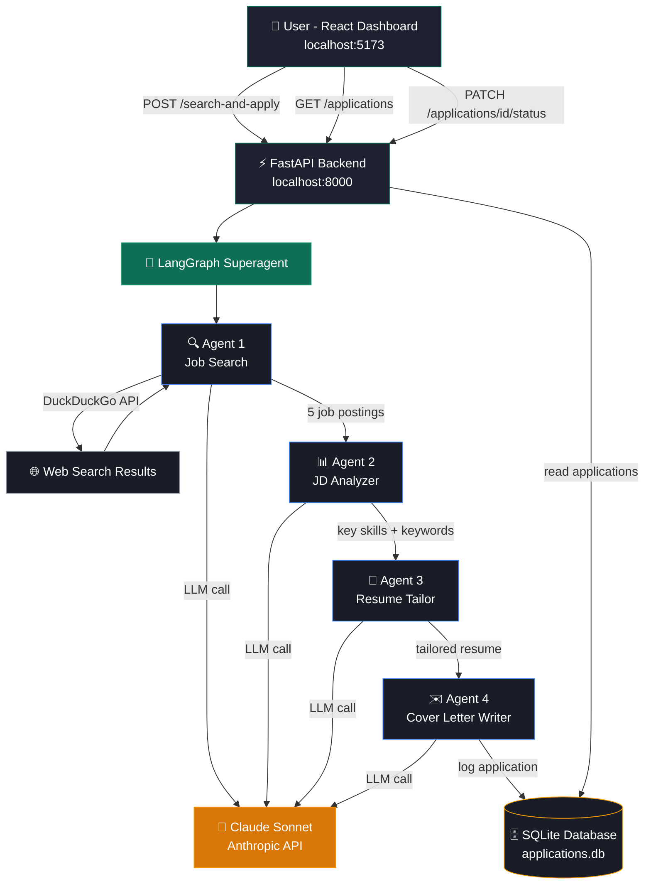

Here's everything in one single copy:

markdown# 🤖 Job Application Superagent

<div align="center">


**An AI-powered fullstack superagent that searches for jobs, tailors your resume, writes cover letters, and tracks every application — all automatically.**

*Developed by Kalash Tejendra Gajjar*

[View Demo](#-getting-started) · [Report Bug](https://github.com/thisiskalashgajjar/job-application-superagent/issues) · [LinkedIn](https://linkedin.com/in/kalashgajjar)

</div>

---

## 📖 Table of Contents

- [About the Project](#-about-the-project)
- [System Architecture](#-system-architecture)
- [Tech Stack](#-tech-stack)
- [The 4 AI Agents](#-the-4-ai-agents)
- [Project Structure](#-project-structure)
- [Getting Started](#-getting-started)
- [API Reference](#-api-reference)
- [Database Schema](#-database-schema)
- [Frontend Design System](#-frontend-design-system)
- [Security Notes](#-security-notes)
- [Roadmap](#-roadmap)
- [Author](#-author)
- [License](#-license)

---

## 📌 About the Project

Job hunting is repetitive, time-consuming, and mentally exhausting. Tailoring a resume for every job posting, writing a unique cover letter for each company, and keeping track of where you applied — all of this takes hours every week.

**Job Application Superagent solves this.**

It is a fullstack AI application that runs a multi-agent pipeline powered by Claude Sonnet and LangGraph. You paste your master resume once, tell the agent your interests and location, and it handles the rest:

- Finds real job postings matching your profile
- Analyzes each job description for ATS keywords and required skills
- Tailors your resume uniquely for each role
- Writes a personalized cover letter for each company
- Logs every application to a database with timestamps
- Displays everything in a clean React dashboard where you can track status from Applied → Interview → Offer

This project was built as a capstone demonstration of agentic AI systems, combining modern LLM orchestration (LangGraph), REST API design (FastAPI), and production-grade frontend development (React + Vite).

---

## 🏗️ System Architecture



---

## 🧠 Tech Stack

### Backend

| Technology | Version | Purpose |
|---|---|---|
| Python | 3.12 | Core language |
| FastAPI | Latest | REST API framework |
| LangGraph | Latest | Multi-agent orchestration |
| LangChain | Latest | LLM tooling and abstractions |
| Claude Sonnet | claude-sonnet-4-5 | LLM backbone via Anthropic API |
| DuckDuckGo Search | Latest | Real-time job discovery |
| SQLite | Built-in | Persistent application database |
| Uvicorn | Latest | ASGI production server |
| python-dotenv | Latest | Secure environment management |
| Pydantic | Latest | Request and response validation |

### Frontend

| Technology | Version | Purpose |
|---|---|---|
| React | 18 | UI component framework |
| Vite | Latest | Lightning-fast build tool |
| React Router | v6 | Client-side page routing |
| Axios | Latest | HTTP client for API calls |
| Lucide React | Latest | Clean icon library |
| CSS Variables | — | Theming and dark mode system |

---

## 🤖 The 4 AI Agents

The core of this project is a **LangGraph sequential pipeline** where each agent feeds its output into the next.

### Agent 1 — Job Search Agent

**Input:** User interests (tags) + location string

**What it does:**
- Constructs a targeted search query combining interests and location
- Uses DuckDuckGo Search to find real, current job postings
- Sends raw search results to Claude Sonnet
- Claude extracts up to 5 structured job postings (title, company, description, URL)
- Returns a clean JSON array of jobs for Agent 2

**Example output:**
```json
[
  {
    "title": "Machine Learning Engineer",
    "company": "TD Bank",
    "description": "We are looking for...",
    "url": "https://linkedin.com/jobs/..."
  }
]
```

---

### Agent 2 — JD Analyzer Agent

**Input:** Raw job postings from Agent 1

**What it does:**
- Iterates over each job posting
- Sends each job description to Claude Sonnet for deep analysis
- Extracts structured intelligence: key technical skills, ATS keywords, writing tone, and seniority level
- Attaches the analysis to each job object for downstream use

**Example output:**
```json
{
  "key_skills": ["Python", "TensorFlow", "MLOps", "AWS SageMaker"],
  "keywords": ["machine learning", "model deployment", "data pipeline"],
  "tone": "corporate",
  "seniority_level": "entry-level"
}
```

---

### Agent 3 — Resume Tailor Agent

**Input:** Master resume text + job analysis from Agent 2

**What it does:**
- Takes your single master resume and transforms it for each specific role
- Reorders bullet points so the most relevant experience appears first
- Adjusts the professional summary to reference the target role
- Weaves in ATS keywords naturally without keyword stuffing
- Preserves 100% factual accuracy — only reframes, never fabricates
- Produces a unique plain-text resume for every job posting

---

### Agent 4 — Cover Letter Agent

**Input:** Job details + analysis from Agent 2

**What it does:**
- Writes a professional, personalized cover letter for each role
- References 2–3 specific skills from the job description naturally
- Matches the tone detected by Agent 2 (corporate, startup, etc.)
- Keeps the letter under 350 words with a clear call to action
- Immediately logs the completed application to SQLite after writing
- Prints a confirmation message to the console for each logged application

---

## 📁 Project Structure

```
job-application-superagent/
│
├── 📄 main.py                  # FastAPI app, all endpoints, server startup
├── 📄 agent.py                 # LangGraph superagent with 4 sub-agents
├── 📄 database.py              # SQLite init, log, update, and query functions
├── 📄 requirements.txt         # All Python dependencies
├── 📄 .env                     # API keys — NOT committed to git
├── 📄 .gitignore               # Excludes .env, db, pycache, node_modules
├── 📄 README.md                # You are here
│
└── 📁 frontend/                # React + Vite dashboard
    ├── 📄 package.json
    ├── 📄 vite.config.js
    └── 📁 src/
        ├── 📄 api.js               # All Axios API call functions
        ├── 📄 App.jsx              # Root component, sidebar, routing
        ├── 📄 App.css              # Layout and sidebar styles
        ├── 📄 main.jsx             # React DOM entry point
        ├── 📄 index.css            # Global CSS variables and reset
        ├── 📁 pages/
        │   ├── 📄 RunAgent.jsx         # Agent trigger form with tag input
        │   ├── 📄 RunAgent.css
        │   ├── 📄 Applications.jsx     # Applications table, stats, modals
        │   └── 📄 Applications.css
        └── 📁 components/
            ├── 📄 Modal.jsx            # Resume and cover letter viewer
            └── 📄 Modal.css
```

---

## 🚀 Getting Started

### Prerequisites

Before you begin, make sure you have:

- [Anaconda](https://www.anaconda.com/download) installed
- [Node.js 18+](https://nodejs.org) installed
- An [Anthropic API key](https://console.anthropic.com) (requires billing setup)
- [Git](https://git-scm.com) installed

---

### 1. Clone the Repository

```bash
git clone https://github.com/thisiskalashgajjar/job-application-superagent.git
cd job-application-superagent
```

---

### 2. Backend Setup

**Create and activate conda environment**
```bash
conda create -n job_agent python=3.12
conda activate job_agent
```

**Install all dependencies**
```bash
pip install fastapi
pip install "uvicorn[standard]"
pip install langgraph
pip install langchain
pip install langchain-anthropic
pip install langchain-community
pip install anthropic
pip install duckduckgo-search
pip install python-dotenv
```

**Create your environment file**
```bash
echo ANTHROPIC_API_KEY=your_actual_key_here > .env
```

Replace `your_actual_key_here` with your real key from [console.anthropic.com](https://console.anthropic.com)

**Start the backend**
```bash
python main.py
```

**Verify it is running**

Open your browser at:
```
http://localhost:8000/health
```
You should see:
```json
{"status": "running"}
```

**Explore the interactive API docs**
```
http://localhost:8000/docs
```

---

### 3. Frontend Setup

**Open a new terminal and navigate to the frontend folder**
```bash
cd frontend
```

**Install dependencies**
```bash
npm install
```

**Start the development server**
```bash
npm run dev
```

**Open the dashboard**
```
http://localhost:5173
```

---

### 4. Using the App

1. Go to the **Run Agent** page
2. Your interests are pre-filled — add or remove tags as needed
3. Confirm your location (default: Toronto, ON)
4. Paste your full resume text into the Master Resume field
5. Click **🚀 Find & Apply**
6. Wait 60–90 seconds while the agent pipeline runs
7. You will be redirected to the **Applications** page automatically
8. View your tailored resume and cover letter for each job using the eye and document icons
9. Update application status as you progress through interviews

---

## 🔌 API Reference

### Health Check

```http
GET /health
```

**Response**
```json
{
  "status": "running"
}
```

---

### Run Agent Pipeline

```http
POST /search-and-apply
```

**Request Body**
```json
{
  "interests": ["AI/ML", "Python", "Data Science"],
  "location": "Toronto, ON",
  "resume_text": "KALASH GAJJAR\nSoftware Engineer...(full resume text)"
}
```

**Response**
```json
{
  "status": "done",
  "jobs_processed": 3,
  "jobs": [
    {
      "title": "Machine Learning Engineer",
      "company": "TD Bank",
      "url": "https://linkedin.com/jobs/...",
      "analysis": {
        "key_skills": ["Python", "TensorFlow"],
        "keywords": ["machine learning", "model deployment"],
        "tone": "corporate",
        "seniority_level": "entry-level"
      },
      "tailored_resume": "KALASH GAJJAR\n...(tailored version)",
      "cover_letter": "Dear Hiring Manager,\n...(personalized letter)"
    }
  ]
}
```

---

### Get All Applications

```http
GET /applications
```

**Response**
```json
[
  {
    "id": 1,
    "job_title": "Machine Learning Engineer",
    "company": "TD Bank",
    "url": "https://...",
    "resume": "...",
    "cover_letter": "...",
    "status": "Applied",
    "applied_at": "2026-05-10T20:52:09"
  }
]
```

---

### Update Application Status

```http
PATCH /applications/{id}/status
```

**Request Body**
```json
{
  "status": "Interview"
}
```

**Valid status values:** `Applied` · `Interview` · `Rejected` · `Offer`

**Response**
```json
{
  "ok": true
}
```

---

## 🗄️ Database Schema

```sql
CREATE TABLE IF NOT EXISTS applications (
    id            INTEGER  PRIMARY KEY AUTOINCREMENT,
    job_title     TEXT,
    company       TEXT,
    url           TEXT,
    resume        TEXT,
    cover_letter  TEXT,
    status        TEXT     DEFAULT 'Applied',
    applied_at    TEXT
);
```

The database file `applications.db` is created automatically on first run and stored locally. It is excluded from version control via `.gitignore` to protect your personal resume and cover letter data.

---

## 🎨 Frontend Design System

| Variable | Value | Usage |
|---|---|---|
| `--bg-primary` | `#0f1117` | Page background |
| `--bg-secondary` | `#1a1d27` | Input and surface backgrounds |
| `--bg-card` | `#1e2130` | Card and table backgrounds |
| `--accent` | `#0F6E56` | Primary teal — buttons and active states |
| `--accent-hover` | `#1D9E75` | Hover and highlight states |
| `--text-primary` | `#ffffff` | Primary text |
| `--text-secondary` | `#9ca3af` | Secondary and muted text |
| `--border` | `#2d3148` | Borders and dividers |

---

## 🔒 Security Notes

- The `.env` file containing your `ANTHROPIC_API_KEY` is listed in `.gitignore` and is **never committed to version control**
- The `applications.db` SQLite file containing your resume data is also **gitignored**
- Always set a **monthly spending cap** on your Anthropic account at [console.anthropic.com](https://console.anthropic.com)
- Never paste your API key directly into any source file
- If you fork this project, generate your own API key

---

## 🛣️ Roadmap

- [x] Multi-agent LangGraph pipeline
- [x] FastAPI REST backend with full CRUD
- [x] React dashboard with dark mode
- [x] Application status tracking
- [x] Resume and cover letter viewer modal
- [x] Real-time search filtering
- [ ] PDF export for tailored resume and cover letter
- [ ] Direct job URL column in applications table
- [ ] Deploy backend to Render
- [ ] Deploy frontend to Vercel
- [ ] Email notification when application status changes
- [ ] Multiple resume profile support
- [ ] Interview preparation notes per application
- [ ] Chrome extension to apply directly from job boards

---

## 👨‍💻 Author

<div align="center">

**Kalash Tejendra Gajjar**

Advanced Diploma — Software Engineering Technology (Artificial Intelligence)
Centennial College, Toronto, ON · GPA: 3.97 / 4.5

[](https://linkedin.com/in/kalashgajjar)
[](https://github.com/thisiskalashgajjar)

</div>

---

## 📄 License

Copyright © 2026 Kalash Tejendra Gajjar. All rights reserved.

This project and all its contents are the intellectual property of Kalash Tejendra Gajjar. No part of this project may be reproduced, distributed, or transmitted in any form or by any means without the prior written permission of the author.
